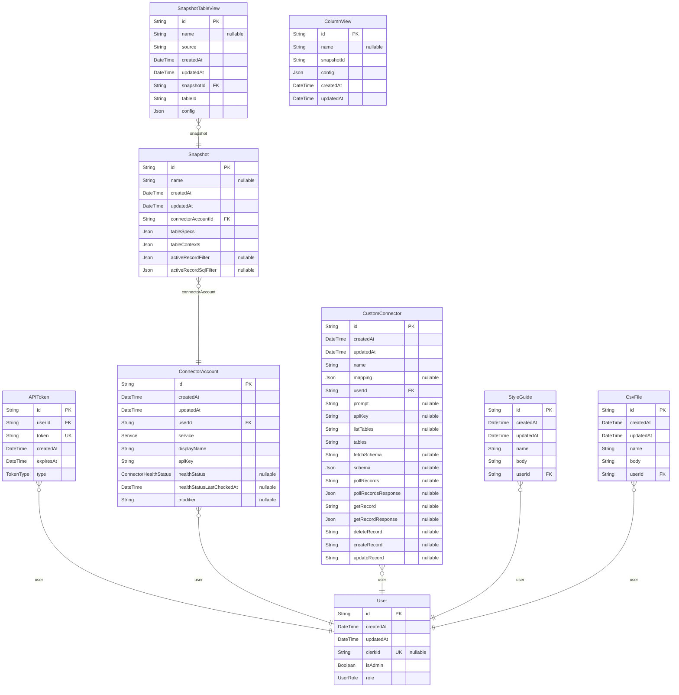

# prisma-db entity relationship diagram

> Generated by [`prisma-markdown`](https://github.com/samchon/prisma-markdown)

- [default](#default)

## default

### `User`

Properties as follows:

- `id`:
- `createdAt`:
- `updatedAt`:
- `clerkId`:
- `isAdmin`:
- `role`:

### `APIToken`

Properties as follows:

- `id`:
- `userId`:
- `token`:
- `createdAt`:
- `expiresAt`:
- `type`:

### `ConnectorAccount`

Properties as follows:

- `id`:
- `createdAt`:
- `updatedAt`:
- `userId`:
- `service`:
- `displayName`:
- `apiKey`:
- `healthStatus`:
- `healthStatusLastCheckedAt`:
- `modifier`:

### `Snapshot`

Properties as follows:

- `id`:
- `name`:
- `createdAt`:
- `updatedAt`:
- `connectorAccountId`:
- `tableSpecs`:
- `tableContexts`:
- `activeRecordFilter`:
- `activeRecordSqlFilter`:

### `CustomConnector`

Properties as follows:

- `id`:
- `createdAt`:
- `updatedAt`:
- `name`:
- `mapping`:
- `userId`:
- `prompt`:
- `apiKey`:
- `listTables`:
- `tables`:
- `fetchSchema`:
- `schema`:
- `pollRecords`:
- `pollRecordsResponse`:
- `getRecord`:
- `getRecordResponse`:
- `deleteRecord`:
- `createRecord`:
- `updateRecord`:

### `SnapshotTableView`

Properties as follows:

- `id`:
- `name`:
- `source`:
- `createdAt`:
- `updatedAt`:
- `snapshotId`:
- `tableId`:
- `config`:

### `StyleGuide`

Properties as follows:

- `id`:
- `createdAt`:
- `updatedAt`:
- `name`:
- `body`:
- `userId`:

### `CsvFile`

Properties as follows:

- `id`:
- `createdAt`:
- `updatedAt`:
- `name`:
- `body`:
- `userId`:

### `ColumnView`

Properties as follows:

- `id`:
- `name`:
- `snapshotId`:
- `config`:
- `createdAt`:
- `updatedAt`:
