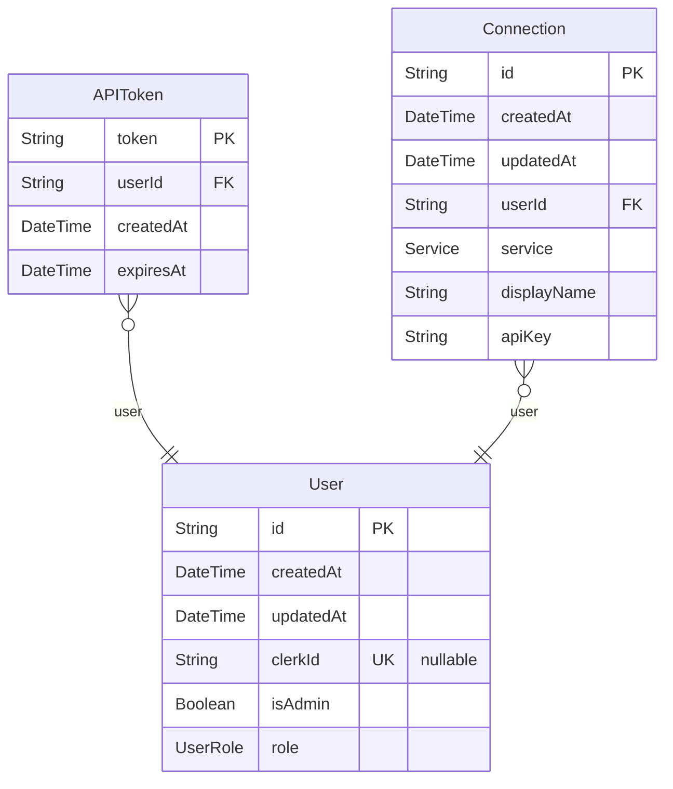

# prisma-db entity relationship diagram

> Generated by [`prisma-markdown`](https://github.com/samchon/prisma-markdown)

- [default](#default)

## default

### `User`

Properties as follows:

- `id`:
- `createdAt`:
- `updatedAt`:
- `clerkId`:
- `isAdmin`:
- `role`:

### `APIToken`

Properties as follows:

- `token`:
- `userId`:
- `createdAt`:
- `expiresAt`:

### `Connection`

Properties as follows:

- `id`:
- `createdAt`:
- `updatedAt`:
- `userId`:
- `service`:
- `displayName`:
- `apiKey`:
